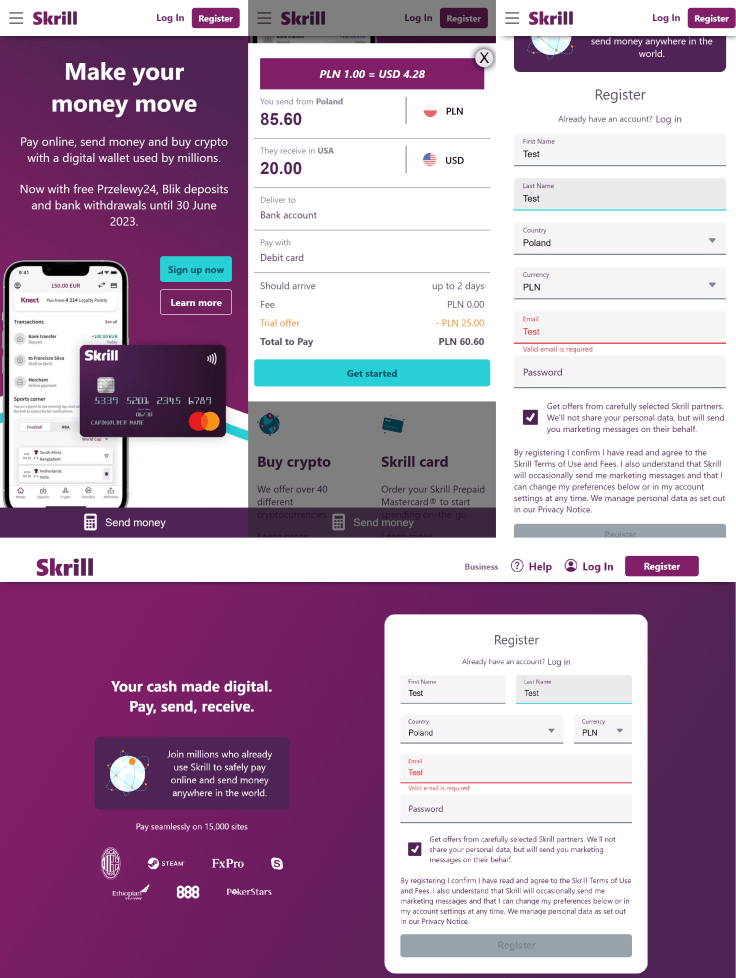

# Digital Wallet - React practice

E-wallet based on the design of a real service provider - Skrill. All content and assets have been used only for training purposes. Project is under development nad more features will be coming soon.

## What i used

           

## Screenshots

## Live

[https://digital-wallet-react-practice.netlify.app/](https://digital-wallet-react-practice.netlify.app/)

## Solutions

- React hooks (useState, useReducer, useEffect)
- Custom input validation hook
- Conditional rendering
- Client-side form validation
- Using createPortal for modal
- Exchange rate calculator
- React Router components (Form, Outlet, Link, NavLink, ScrollRestoration), hook (useNavigation), actions
- Dropdown elements
- CSS Modules
- Custom checkbox in the form

## Next goals

- Communication with the database to fetch information
- Checking if the user is logged in
- Create dashboard with editing elements
- Apply React Router loaders
- State management
- Components refactoring to increase reusability
